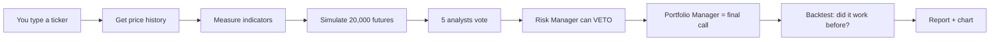
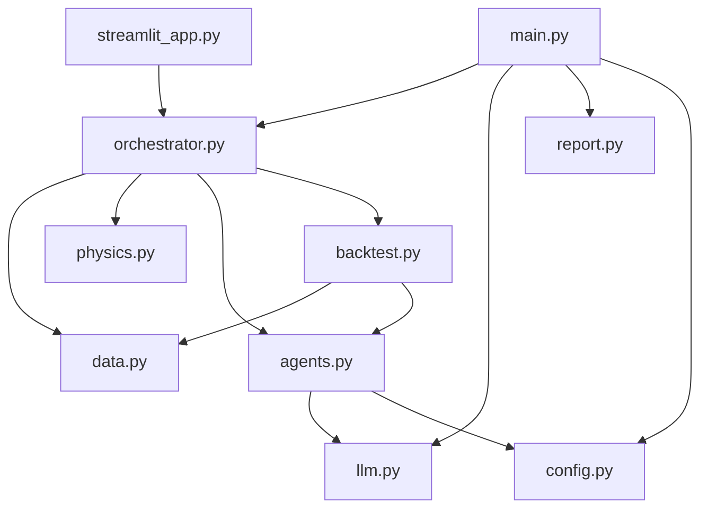
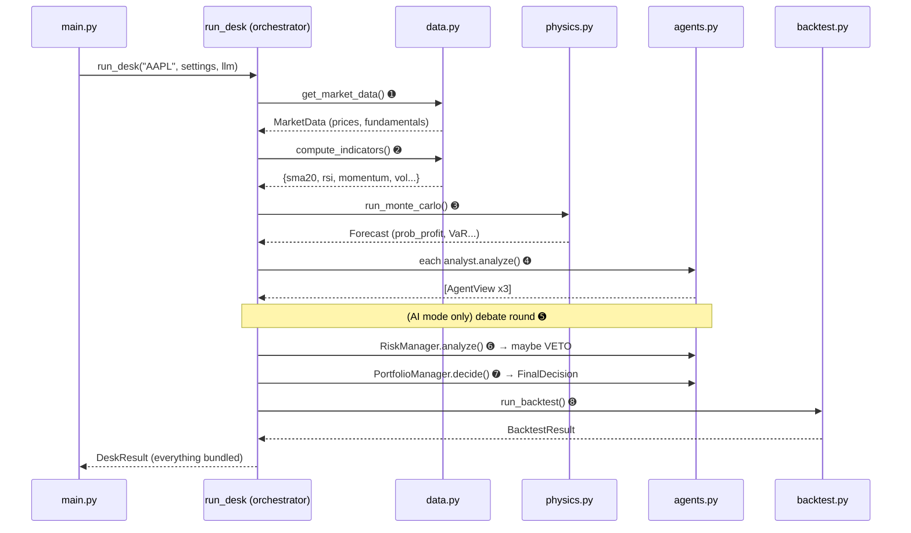
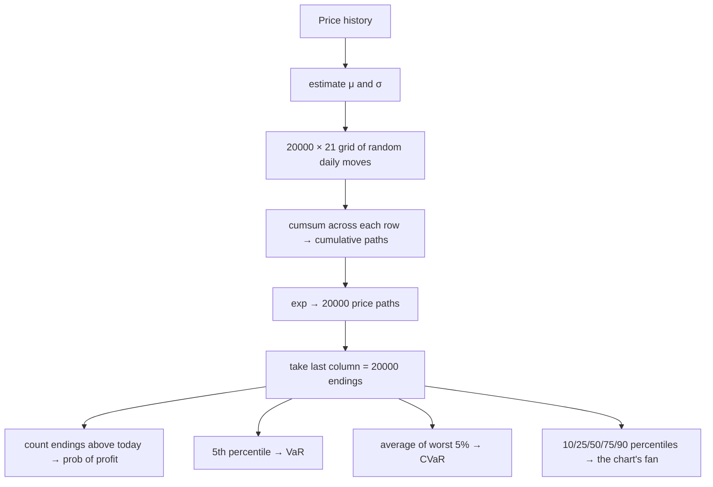
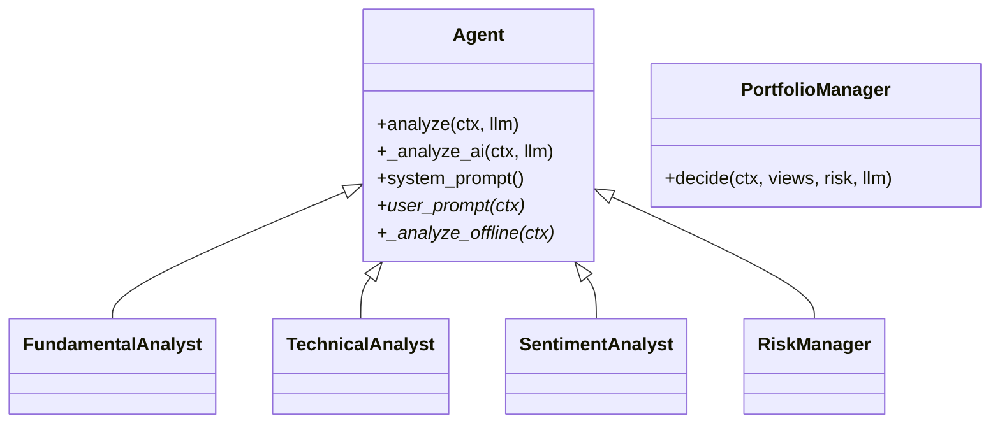

# 🔬 CODE DEEP DIVE — understand this whole project from zero

> **Who this is for:** you, sitting in front of this codebase, wanting to *actually understand every line* — not memorize talking points.
>
> **How this doc is different from the others:**
> - `README.md` = the sales pitch (what & why).
> - `STUDY_GUIDE.md` = the *concepts* (finance + interview answers).
> - **`CODE_DEEP_DIVE.md` (this file) = the *code itself*, explained from the absolute basics, with pictures and a real worked example.**
>
> You do **not** need to know finance or advanced Python. Every term and every Python trick is explained the first time it shows up. Read top to bottom once; after that you'll be able to open any file and know exactly what it's doing.

---

## 📑 Contents

- [Part 0 — The one-paragraph mental model](#part-0--the-one-paragraph-mental-model)
- [Part 1 — How the project is physically organized (files, folders, imports)](#part-1--how-the-project-is-physically-organized)
- [Part 2 — The "nouns": every data structure that flows through the system](#part-2--the-nouns-data-structures)
- [Part 3 — The "verbs": the pipeline, one stage at a time](#part-3--the-verbs-the-pipeline-stage-by-stage)
  - [3.0 The 30,000-ft pipeline picture](#30-the-pipeline-picture)
  - [3.1 `main.py` — the front door](#31-mainpy--the-front-door)
  - [3.2 `config.py` — the settings dials](#32-configpy--the-settings-dials)
  - [3.3 `data.py` — get prices + compute indicators](#33-datapy--get-prices--compute-indicators)
  - [3.4 `physics.py` — the Monte Carlo engine (the hard part, made easy)](#34-physicspy--the-monte-carlo-engine)
  - [3.5 `llm.py` — the offline↔AI flip switch](#35-llmpy--the-flip-switch)
  - [3.6 `agents.py` — the five-person research team](#36-agentspy--the-five-person-team)
  - [3.7 `orchestrator.py` — the conductor](#37-orchestratorpy--the-conductor)
  - [3.8 `backtest.py` — grading its own homework](#38-backtestpy--grading-its-own-homework)
  - [3.9 `report.py` — turning results into output](#39-reportpy--turning-results-into-output)
  - [3.10 `streamlit_app.py` — the web version](#310-streamlit_apppy--the-web-version)
- [Part 4 — A full run traced with REAL numbers (AAPL)](#part-4--a-full-run-traced-with-real-numbers)
- [Part 5 — The Python toolbox used (mini-reference)](#part-5--the-python-toolbox-used)
- [Part 6 — Run it yourself + safe experiments](#part-6--run-it-yourself--safe-experiments)

---

## Part 0 — The one-paragraph mental model

You type a **stock ticker** (like `AAPL`). The program:

1. **gets that stock's price history**,
2. **measures** a few things about it (is it trending up? how bumpy is it?),
3. **simulates 20,000 imaginary futures** for the price (the "physics engine"),
4. asks **five pretend analysts** for an opinion (BUY / HOLD / SELL),
5. has a **risk manager** that can **forbid** a risky BUY,
6. has a **portfolio manager** combine everything into one final call,
7. **checks whether this kind of signal worked in the past** (the backtest),
8. and **prints a report + draws a chart**.

That's the whole thing. Everything below is just *how* each step is built.



Two words you'll see constantly:
- **The desk** = the team of agents (the "AI" half).
- **The engine** = the math: indicators, Monte Carlo, backtest (the "science" half).

---

## Part 1 — How the project is physically organized

### 1.1 The folder layout

```
app2/
├── main.py              ← you run THIS (the command-line entry point)
├── streamlit_app.py     ← OR you run this (the web entry point)
├── requirements.txt     ← the list of libraries to install
├── ai_desk/             ← the actual brain, split into 8 small files ("a package")
│   ├── __init__.py      ← marks this folder as an importable package (often empty)
│   ├── config.py        ← all the tunable numbers in one place
│   ├── data.py          ← gets prices, computes indicators
│   ├── physics.py       ← the Monte Carlo simulation
│   ├── llm.py           ← the switch between "free" and "use Claude"
│   ├── agents.py        ← the 5 analyst personalities
│   ├── orchestrator.py  ← runs all the steps in order
│   ├── backtest.py      ← tests the strategy on past data
│   └── report.py        ← prints the dashboard, saves the report + chart
└── outputs/             ← generated reports (.md) and charts (.png) land here
```

**Why so many files instead of one big one?** This is called **separation of concerns**: each file has exactly one job. If the chart looks wrong, you go to `report.py` and nowhere else. This is the #1 habit that makes code readable, and interviewers notice it.

### 1.2 What "a module" and "a package" mean (Python basics)

- A **module** is just *one `.py` file*. `physics.py` is a module.
- A **package** is a *folder of modules* that Python can import from. `ai_desk/` is a package — the empty `__init__.py` file is what tells Python "treat this folder as a package."

### 1.3 How files talk to each other: `import`

At the top of `orchestrator.py` you'll see:

```python
from .data import MarketData, get_market_data, compute_indicators
from .physics import Forecast, run_monte_carlo
```

Read this as: *"from the `data` module, grab the names `MarketData`, `get_market_data`, `compute_indicators` so I can use them here."*

The **leading dot** in `.data` means **"a sibling file in this same package."** It's a *relative import*. So `orchestrator.py` is pulling in tools from its neighbors `data.py` and `physics.py`.

Here's who imports whom (an arrow means "uses"):



Notice the shape: **everything funnels into `orchestrator.py`**. That's the conductor. `main.py` and `streamlit_app.py` are just two different "remote controls" for the same engine.

### 1.4 One Python idiom you'll see in every file

```python
from __future__ import annotations
```

Ignore the scary name. It just lets the code write modern type hints (like `list[str]`) on every Python version without errors. It changes nothing about behavior. Move on.

---

## Part 2 — The "nouns": data structures

Before the verbs (functions), learn the **nouns** — the little containers of data that get passed from stage to stage. If you know the shape of the data flowing through the pipes, the functions are easy.

Every one of these is a **`@dataclass`**. A dataclass is just a labelled box. Instead of a plain dictionary where you might typo a key, you declare the fields once and Python gives you a tidy typed object.

```python
@dataclass
class AgentView:
    agent: str          # e.g. "Technical Analyst"
    signal: str         # "BUY" | "HOLD" | "SELL"
    confidence: float   # 0.0 - 1.0
    rationale: list[str] = field(default_factory=list)  # the reasons
    veto: bool = False  # only the Risk Manager ever sets this True
```

- `agent: str` means "this box has a slot called `agent` that holds text."
- `= False` gives a **default**, so you don't have to specify it every time.
- `field(default_factory=list)` is the correct way to default to *an empty list* (see [Part 5](#part-5--the-python-toolbox-used) for *why* you can't just write `= []`).

Here are **all** the boxes and which file defines each:

| Box (dataclass) | Defined in | Holds | Created by |
|---|---|---|---|
| **`MarketData`** | `data.py` | ticker, price history, current price, fundamentals, news, source | `get_market_data()` |
| **`Forecast`** | `physics.py` | the 20,000 simulated paths + summary odds (prob of profit, VaR, etc.) | `run_monte_carlo()` |
| **`AgentView`** | `agents.py` | one analyst's signal + confidence + reasons (+ veto flag) | each agent's `analyze()` |
| **`FinalDecision`** | `agents.py` | the final BUY/HOLD/SELL, confidence, position size %, written thesis | `PortfolioManager.decide()` |
| **`BacktestResult`** | `backtest.py` | hit-rate, strategy vs buy-and-hold, etc. | `run_backtest()` |
| **`DeskResult`** | `orchestrator.py` | **all of the above bundled together** | `run_desk()` |

Visually, `DeskResult` is the big envelope that contains every other box:

```
┌─────────────────────────── DeskResult ───────────────────────────┐
│  md         → MarketData   (prices, fundamentals, news)           │
│  indicators → dict         (sma20, sma50, rsi, momentum, vol...)  │
│  forecast   → Forecast     (paths, prob_profit, var, cvar...)     │
│  views      → [AgentView, AgentView, AgentView]  (the 3 analysts) │
│  risk       → AgentView    (the Risk Manager, maybe veto=True)    │
│  decision   → FinalDecision (signal, confidence, size, thesis)    │
│  backtest   → BacktestResult                                      │
│  ai_mode    → bool          (was Claude used?)                    │
└───────────────────────────────────────────────────────────────────┘
```

The report layer's whole job is to take this one envelope and pretty-print it. So once `run_desk()` builds a `DeskResult`, the analysis is *done*.

---

## Part 3 — The "verbs": the pipeline, stage by stage

### 3.0 The pipeline picture

This is the single most important diagram in the project. It's literally the body of `run_desk()` in [orchestrator.py:34](ai_desk/orchestrator.py#L34):



The numbered circles ➊–➑ map to the `log("[1/6]...")` lines you see when you run it. Keep this picture open while reading the rest of Part 3.

---

### 3.1 `main.py` — the front door

📄 [main.py](main.py) · ~70 lines. This is what runs when you type `python main.py AAPL`.

**Step A — read the command line.** Python's built-in `argparse` library turns the words you typed into variables:

```python
parser.add_argument("ticker", nargs="?", default="AAPL")   # the stock symbol
parser.add_argument("--ai", action="store_true")           # a flag (on/off)
parser.add_argument("--horizon", type=int)                 # a number
```

- `"ticker"` (no dashes) is a **positional** argument — the first word after the script. `nargs="?"` + `default="AAPL"` means *"it's optional; if you don't give one, use AAPL."*
- `--ai` with `action="store_true"` is a **flag**: present → `True`, absent → `False`. This is the famous "flip switch."
- `--horizon` `type=int` expects a number after it (`--horizon 42`).

So `python main.py NVDA --ai --horizon 42` becomes `args.ticker="NVDA"`, `args.ai=True`, `args.horizon=42`.

**Step B — load secrets from a `.env` file** ([main.py:39-43](main.py#L39)):

```python
try:
    from dotenv import load_dotenv
    load_dotenv()
except ImportError:
    pass
```

A `.env` file is where you put your secret `ANTHROPIC_API_KEY` so it never gets committed to git. `load_dotenv()` reads that file into the program's environment. The `try/except ImportError` means: *"if the `python-dotenv` library isn't installed, just skip this — don't crash."* This "don't crash on a missing optional thing" pattern repeats all over the project.

**Step C — build the settings and the LLM switch** ([main.py:45-54](main.py#L45)):

```python
settings = Settings()                 # all default numbers
if args.horizon:
    settings.horizon_days = args.horizon   # override if you asked
llm = LLM(want_ai=args.ai)            # the switch object
print(f"\n>>> Mode: {llm.status}")
```

**Step D — run the desk and print results** ([main.py:56-66](main.py#L56)):

```python
result = run_desk(args.ticker, settings, llm)   # ← all the work happens here
render_terminal(result)                         # pretty dashboard
md_path = save_markdown(result)                 # save a .md file
if not args.no_chart:
    chart = save_chart(result)                  # save a .png
```

That's the entire front door. It parses input, flips the switch, calls `run_desk`, and hands the result to the report layer.

---

### 3.2 `config.py` — the settings dials

📄 [config.py](ai_desk/config.py) · ~50 lines. No logic here — it's a panel of dials.

```python
ANALYST_MODEL  = "claude-haiku-4-5-20251001"   # cheap + fast (used a lot)
PORTFOLIO_MODEL = "claude-opus-4-8"             # strongest (used once)
```

Two different Claude models on purpose: the analysts make *many* calls so they use the cheap fast one; the single final verdict uses the powerful one. "Right tool for the job" = cost discipline.

```python
@dataclass
class Settings:
    horizon_days: int = 21        # how far into the future we forecast (~1 month)
    history_days: int = 400       # how much past data to pull
    mc_paths: int = 20_000        # number of simulated futures
    var_confidence: float = 0.05  # "worst 5%" definition for risk
    risk_max_annual_vol: float = 0.60  # VETO a BUY if volatility > 60%
    risk_max_var: float = 0.18         # VETO a BUY if 5% VaR loss > 18%
    debate_rounds: int = 1
    seed: int = 42                # makes random results repeatable
    backtest_points: int = 12
```

> 💡 `20_000` is just `20000` — Python lets you put underscores in numbers for readability. `0.05` etc. are fractions (5%).

The two `risk_max_*` lines are the **safety guardrail thresholds**. They live in plain config, *not* inside any AI prompt — that's the whole point (the model can't argue with a number in a config file).

```python
AGENT_WEIGHTS = {
    "Fundamental Analyst": 0.40,
    "Technical Analyst":   0.35,
    "Sentiment Analyst":   0.25,
}
```

When the Portfolio Manager combines the three analysts' votes, the Fundamental Analyst's vote counts most (40%) and Sentiment least (25%). These weights sum to 1.0.

---

### 3.3 `data.py` — get prices + compute indicators

📄 [data.py](ai_desk/data.py) · ~190 lines. Two jobs: **(1) get the data**, **(2) measure it**.

#### Job 1: get the data — `get_market_data()`

```python
def get_market_data(ticker, settings) -> MarketData:
    try:
        return _fetch_from_yahoo(ticker, settings)   # try the real internet
    except Exception as exc:
        print("  (!) Live data unavailable; using a synthetic stock instead.")
        return _make_synthetic(ticker, settings)      # otherwise, fake one
```

This is **graceful degradation** in three lines. It *tries* to download real prices from Yahoo Finance (free, no key). If anything at all goes wrong — no internet, bad ticker, library not installed — the `except` branch catches it and **invents a realistic fake stock instead**. The program therefore *always* runs, even on a plane with no WiFi.

> 🧠 `except Exception as exc:` means "catch any error and call it `exc`." `type(exc).__name__` later just prints the error's name (like `ConnectionError`) so the message is informative but the program survives.

**The real path** (`_fetch_from_yahoo`, [data.py:52](ai_desk/data.py#L52)):

```python
import yfinance as yf      # imported HERE, not at top of file — "lazy import"
tk = yf.Ticker(ticker)
hist = tk.history(period=f"{settings.history_days}d", auto_adjust=True)
prices = hist["Close"].dropna()    # just the daily closing prices
```

> 💡 **Lazy import:** notice `import yfinance` is *inside* the function, not at the top of the file. Why? So that offline mode never even needs `yfinance` installed. You only pay for a library when you actually use it.

It then pulls **fundamentals** (P/E ratio, profit margin, revenue growth…) from `tk.info`, guarding every field with `.get(...)` so a missing value returns `None` instead of crashing. It also grabs up to 8 recent **news headlines**. All of this gets packed into a `MarketData` box.

**The fake path** (`_make_synthetic`, [data.py:106](ai_desk/data.py#L106)) is itself a mini-physics-engine — it generates a believable fake price history using the *same* Brownian-motion math as the real engine (we'll explain that math in 3.4):

```python
rng = np.random.default_rng(abs(hash(ticker)) % (2**32))  # seeded by the ticker
...
shocks = (mu - 0.5 * sigma**2) + sigma * rng.standard_normal(n)
path = start_price * np.exp(np.cumsum(shocks))
```

> 💡 **Seeded by the ticker** means `AAPL` always produces the *same* fake stock every time (because the random seed is derived from the word "AAPL"). Reproducibility, even in the fallback.

#### Job 2: measure it — `compute_indicators()`

This takes the price series and returns a plain dictionary of numbers ([data.py:148](ai_desk/data.py#L148)). Here's each indicator in plain English:

**SMA — Simple Moving Average** (the trend):
```python
sma20 = float(p.rolling(20).mean().iloc[-1])   # avg of the last 20 days
sma50 = float(p.rolling(50).mean().iloc[-1])   # avg of the last 50 days
```
`p.rolling(20).mean()` slides a 20-day window across the prices and averages each window. `.iloc[-1]` grabs the *most recent* one. If today's price is above the 50-day average **and** the 20-day average is above the 50-day average, we call it an **uptrend**:
```python
"trend_up": sma20 > sma50 and close > sma50,
```

**Momentum** (is it moving?):
```python
momentum = float(p.iloc[-1] / p.iloc[-21] - 1)   # % change over ~1 month
```
`p.iloc[-1]` = today's price, `p.iloc[-21]` = the price 21 trading days ago. Dividing and subtracting 1 gives a percentage change. `+0.05` means "up 5% in the last month."

**Annualized volatility** (how bumpy?):
```python
log_ret = np.log(p / p.shift(1)).dropna()       # daily log returns
annual_vol = float(log_ret.std() * np.sqrt(252))
```
- `p.shift(1)` is yesterday's price aligned next to today's, so `p / p.shift(1)` is the daily growth factor.
- `np.log(...)` turns it into a **log return** (explained in 3.4 — they're mathematically convenient because they add up).
- `.std()` is the **standard deviation** — the typical size of a daily wiggle.
- `* np.sqrt(252)` scales the *daily* wiggle up to a *yearly* one. Why √252 and not ×252? Because randomness grows with the **square root** of time, and there are ~252 trading days in a year. This is the **"square-root-of-time rule."**

**52-week range position** (where in its yearly range is it?):
```python
window = p.tail(252)
range_pos = (close - lo) / (hi - lo)   # 0 = at the year's low, 1 = at the high
```

**RSI — Relative Strength Index** (`_rsi`, [data.py:180](ai_desk/data.py#L180)), a 0–100 gauge of "did it rise too fast or fall too fast?":
```python
delta = prices.diff().dropna()                  # day-to-day price changes
gain  = delta.clip(lower=0).rolling(period).mean()   # avg of up-moves
loss  = (-delta.clip(upper=0)).rolling(period).mean()# avg of down-moves
rs  = gain / loss
rsi = 100 - 100 / (1 + rs)
```
- `delta.clip(lower=0)` keeps only the up-days (negatives become 0). `(-delta.clip(upper=0))` keeps only the down-days (as positives).
- If up-moves dominate, `rs` is large and RSI → near 100 ("**overbought**", might pull back, usually >70). If down-moves dominate, RSI → near 0 ("**oversold**", might bounce, usually <30).

The dictionary returned looks like:
```python
{"close": 298.94, "sma20": 290.1, "sma50": 286.98, "trend_up": True,
 "rsi": 40, "momentum_1m": 0.01, "annual_vol": 0.29, "range_pos": 0.78}
```
Both the rule-based agents *and* the Claude agents read these same numbers.

---

### 3.4 `physics.py` — the Monte Carlo engine

📄 [physics.py](ai_desk/physics.py) · ~107 lines. **This is the star of the show.** Take your time here; once it clicks, it's genuinely simple.

#### The idea in one sentence
> We can't know the future, so we **roll the dice 20,000 times** to generate 20,000 plausible futures, then just **count** how they turned out.

#### The model: Geometric Brownian Motion (GBM)
A stock price wanders randomly, like a speck of dust jiggling in water (that's **Brownian motion**, Einstein 1905). The standard finance version is **GBM**:

```
dS = μ·S·dt  +  σ·S·dW
     └ drift ┘   └ random kicks ┘
```
- `μ` (mu) = **drift**: the average daily push (up or down).
- `σ` (sigma) = **volatility**: how big the random kicks are.
- `dW` = a random number (a "kick") each step.

We don't solve this with calculus. We simulate it one day at a time using this discrete formula:

```
one day's log-return = (μ − ½σ²) + σ·Z        where Z is a random normal number
```

> 💡 **What's that `− ½σ²`?** It's the **Itô correction**. Without getting deep: volatility alone would secretly bias the *average* simulated price upward, so we subtract `½σ²` to cancel that bias and keep the average honest. Knowing this term exists is interview gold — most people who "import a Monte Carlo library" have never heard of it.

#### Step 1 — estimate μ and σ from history (`estimate_parameters`)
```python
log_returns = np.log(prices / prices.shift(1)).dropna()
mu    = float(log_returns.mean())   # average daily move
sigma = float(log_returns.std())    # typical daily wiggle
```
So we *learn* the personality of this specific stock from its own past.

#### Step 2 — simulate 20,000 futures (`run_monte_carlo`, [physics.py:62](ai_desk/physics.py#L62))

Here's where **NumPy** earns its keep. Instead of a slow Python loop running 20,000 × 21 times, NumPy does the whole thing as **array math** in one shot (this is called **vectorization** — see [Part 5](#part-5--the-python-toolbox-used)).

```python
z = rng.standard_normal(size=(n, h))        # n=20000 rows, h=21 cols of random numbers
daily = (mu - 0.5 * sigma**2) + sigma * z   # apply the GBM formula to EVERY cell
log_paths = np.cumsum(daily, axis=1)        # add up each row left-to-right
price_paths = s0 * np.exp(log_paths)        # turn log-returns back into prices
paths = np.hstack([np.full((n, 1), s0), price_paths])  # glue today's price on the front
```

**Picture the arrays.** Think of a giant spreadsheet, 20,000 rows (one per imaginary future) × 21 columns (one per day):

```
            day1    day2    day3   ...   day21
future #1 [ +0.4%  -0.2%  +0.1%  ...  +0.3% ]   ← random daily moves (the "z"/daily grid)
future #2 [ -0.1%  +0.5%  -0.3%  ...  -0.2% ]
future #3 [ +0.2%  +0.1%  +0.4%  ...  +0.1% ]
   ...
future #20000 [ ... ]
```

- `np.cumsum(daily, axis=1)` means **"add up along each row"** (`axis=1` = horizontally). Row #1 becomes a running total: `+0.4%, +0.2%, +0.3%, ...` — that's the cumulative path of one future.
- `s0 * np.exp(log_paths)` converts those cumulative log-returns back into actual prices (multiplying today's price `s0`).
- `np.hstack([... , price_paths])` glues today's known price as column 0 so every path starts at the same point. Final shape: **(20000, 22)**.

Tiny concrete example with **3 futures × 2 days**, starting price `s0 = 100`:
```
daily moves (log):          cumulative (cumsum, axis=1):     prices = 100·e^(cum):
[ +0.01  +0.02 ]            [ +0.01  +0.03 ]                 [ 101.0  103.0 ]
[ -0.03  +0.01 ]      →     [ -0.03  -0.02 ]        →        [  97.0   98.0 ]
[ +0.00  -0.04 ]            [ +0.00  -0.04 ]                 [ 100.0   96.1 ]
```
The last column is where each future *ended up*. With 20,000 of these, the endings form a whole distribution.

#### Step 3 — read the odds straight off the endings
```python
end_prices = paths[:, -1]          # the last column: 20,000 ending prices
returns = end_prices / s0 - 1.0    # each ending as a % gain/loss

expected_return = float(returns.mean())          # average outcome
prob_profit     = float((end_prices > s0).mean())# fraction of futures that ended UP
```

> 💡 **The slickest line:** `(end_prices > s0).mean()`. `end_prices > s0` produces an array of `True`/`False` (did this future end above today's price?). In NumPy `True`=1 and `False`=0, so `.mean()` of that is literally **the fraction that were True** — i.e. the **probability of profit**. No loop, no counter.

**Value-at-Risk and CVaR** (how bad is the bad case?):
```python
var_return = float(np.quantile(returns, 0.05))   # the 5th-percentile outcome
var = max(0.0, -var_return)                       # express the loss as a positive number
tail = returns[returns <= var_return]             # ONLY the worst 5% of outcomes
cvar = float(-tail.mean())                         # their AVERAGE loss
```
- **VaR (Value-at-Risk):** sort all 20,000 returns; the one 5% from the bottom is the threshold "you won't do worse than this 95% of the time."
- `returns[returns <= var_return]` is **boolean-mask indexing**: keep only the returns that are in that worst tail.
- **CVaR:** the *average* of that tail — "if the bad case happens, how bad on average?" CVaR is always ≥ VaR and is more honest about disasters.

Finally everything is packed into a `Forecast` box (`prob_profit`, `var`, `cvar`, `expected_return`, `percentiles`, and the raw `paths` for the chart).



---

### 3.5 `llm.py` — the flip switch

📄 [llm.py](ai_desk/llm.py) · ~66 lines. The single, *only* place that talks to Claude. Everything else just asks it `is_enabled?` and calls `ask(...)`.

```python
class LLM:
    def __init__(self, want_ai=False):
        self.is_enabled = False
        self.client = None
        if not want_ai:
            return                                   # you didn't ask for AI → stay offline
        api_key = os.environ.get("ANTHROPIC_API_KEY")
        if not api_key:
            self._reason = "ANTHROPIC_API_KEY not set -- staying in offline mode"
            return                                   # no key → stay offline
        try:
            import anthropic
            self.client = anthropic.Anthropic(api_key=api_key)
            self.is_enabled = True                   # success → AI mode ON
        except ImportError:
            self._reason = "`anthropic` package not installed"
```

Read the logic as a series of gates: **you must (1) pass `--ai`, AND (2) have a key set, AND (3) have the `anthropic` library installed.** Fail any gate and it quietly stays in free offline mode. It *never crashes* just because AI isn't available — it degrades.

The `ask` method is the actual Claude call:
```python
def ask(self, model, system, prompt, max_tokens=700):
    if not self.is_enabled:
        raise RuntimeError("LLM.ask() called while in offline mode")  # safety check
    resp = self.client.messages.create(
        model=model, max_tokens=max_tokens, system=system,
        messages=[{"role": "user", "content": prompt}],
    )
    return "".join(b.text for b in resp.content if getattr(b, "type", None) == "text").strip()
```
It sends one message (a `system` instruction + a `user` `prompt`) and stitches the text pieces of the reply into a single string. That's it. This thin wrapper is why the rest of the code never has to know anything about the Anthropic API.

> 🧠 **Why is this design good?** The whole app depends on Claude through *one tiny door*. Want to swap to a different model provider? You edit only this file. This is the **Strategy pattern** + **graceful degradation**, and it's a strong "production judgment" signal.

---

### 3.6 `agents.py` — the five-person team

📄 [agents.py](ai_desk/agents.py) · ~456 lines (the biggest file). This is the "multi-agent" heart.

#### 3.6.1 The shared shape: a base class + subclasses

There's a base class `Agent` and the specific analysts **inherit** from it. Inheritance means "is a kind of" — `FundamentalAnalyst` *is a kind of* `Agent`, so it gets all of `Agent`'s machinery for free and only overrides the parts that differ.



(`*` marks methods each subclass must fill in. `PortfolioManager` is separate — it doesn't vote, it *judges*.)

The key method on the base is `analyze` ([agents.py:141](ai_desk/agents.py#L141)) — it's the **fork in the road** between the two brains:

```python
def analyze(self, ctx, llm) -> AgentView:
    if llm.is_enabled:                       # AI mode?
        try:
            return self._analyze_ai(ctx, llm)   # → ask Claude
        except Exception as exc:
            view = self._analyze_offline(ctx)   # Claude failed? fall back to the rule
            view.rationale.append(f"(AI call failed: {type(exc).__name__}; used rule-based logic)")
            return view
    return self._analyze_offline(ctx)        # offline mode → use the rule
```

**This one method is the entire offline↔AI abstraction.** Notice the `try/except`: even in AI mode, if Claude errors out, the agent *silently falls back to its deterministic rule* and notes it. The app cannot be taken down by a flaky API.

#### 3.6.2 The AI path: `_analyze_ai`

```python
def _analyze_ai(self, ctx, llm) -> AgentView:
    prompt = self.user_prompt(ctx)           # each agent builds its own question
    peers = ctx.get("peer_views")            # in a debate round, the colleagues' views
    if peers:
        prompt += "\n\nYour colleagues currently think:\n" + peers + "\nReconsider..."
    raw = llm.ask(self.model, system=self.system_prompt(), prompt=prompt + "\n\n" + _JSON_RULE)
    data = _parse_json(raw)
    return AgentView(agent=self.name, signal=_norm_signal(data.get("signal")),
                     confidence=float(data.get("confidence", 0.5) or 0.5),
                     rationale=...)
```

Two things to notice:
1. **It asks for strict JSON.** `_JSON_RULE` tells Claude *"reply with ONLY `{"signal":..., "confidence":..., "rationale":[...]}`"*. Structured output is easy to parse programmatically.
2. **It's robust to messy replies.** `_parse_json` ([agents.py:73](ai_desk/agents.py#L73)) first tries `json.loads`; if Claude wrapped the JSON in prose, a regex `re.search(r"\{.*\}", raw)` digs the `{...}` out. If all else fails it returns `{}` and sane defaults kick in. **It will not crash on a malformed model response.**

#### 3.6.3 The offline brains (the deterministic rules)

Each analyst has a transparent `_analyze_offline` that scores the numbers with plain `if` statements. The clearest example is the **Technical Analyst's** rule, factored into a standalone function `technical_signal` ([agents.py:98](ai_desk/agents.py#L98)) — *standalone on purpose, because the backtester reuses the exact same function* (so the backtest tests the real rule, not a copy):

```python
def technical_signal(ind):
    score = 0.0
    if ind["trend_up"]:   score += 1; reasons.append("Uptrend...")
    else:                 score -= 1; reasons.append("Downtrend...")
    rsi = ind["rsi"]
    if   rsi < 30: score += 1   # oversold → bullish
    elif rsi > 70: score -= 1   # overbought → bearish
    mom = ind["momentum_1m"]
    if   mom >  0.02: score += 1
    elif mom < -0.02: score -= 1
    signal = _score_to_signal(score, band=0.5)             # +→BUY, −→SELL, near 0→HOLD
    confidence = min(0.9, 0.35 + abs(score) / 4)           # stronger score → more confident
    return signal, confidence, reasons
```

It's just a tally: +1 for each bullish sign, −1 for each bearish sign. Then `_score_to_signal` ([agents.py:65](ai_desk/agents.py#L65)) turns the number into a word:
```python
def _score_to_signal(score, band=0.15):
    if score >  band: return "BUY"
    if score < -band: return "SELL"
    return "HOLD"
```
The **Fundamental** rule does the same with P/E, growth, and margin; the **Sentiment** rule counts positive vs. negative keywords in headlines (or, if there are no headlines, falls back to recent price direction). All fully transparent — no black box.

#### 3.6.4 The Risk Manager — the un-overridable veto ⭐

`RiskManager` **overrides `analyze` entirely** ([agents.py:319](ai_desk/agents.py#L319)) so it never uses an LLM for the actual decision. Its verdict is pure arithmetic against the config thresholds:

```python
if fc.annual_vol > s.risk_max_annual_vol:     # > 60%?
    veto = True
if fc.var > s.risk_max_var:                   # 5% VaR loss > 18%?
    veto = True
```

In AI mode it *may* ask Claude for a one-sentence flavor comment — but look closely: that comment is only **appended to `reasons`**. The `veto` boolean was already decided by the `if` statements above and **Claude never touches it**:

```python
if llm.is_enabled:
    try:
        note = llm.ask(..., "You are a blunt risk manager. One sentence only.", ...)
        if note: reasons.append(note)     # commentary ONLY
    except Exception:
        pass                              # if it fails, no problem
```

> 💡 **This is the AI-safety centerpiece.** The dangerous decision (block a risky trade) lives in **code you can read and test**, not in a natural-language instruction a model might ignore or be jailbroken past. "Separate creative reasoning from non-negotiable rules" — say this in an interview.

#### 3.6.5 The Portfolio Manager — the final judge

`PortfolioManager.decide` ([agents.py:375](ai_desk/agents.py#L375)) is the grand finale. Six steps:

```python
# 1) Weighted vote of the three analysts
weighted = 0.0
for v in views:
    w = AGENT_WEIGHTS.get(v.agent, 0.0)
    weighted += _VOTE[v.signal] * v.confidence * w     # BUY=+1, HOLD=0, SELL=−1
net = weighted

# 2) Tilt by the physics engine — better odds nudge bullish
net += (fc.prob_profit - 0.5) * 0.6

# 3) Turn the number into a word
signal = _score_to_signal(net, band=0.12)

# 4) ENFORCE the veto — a vetoed BUY becomes HOLD
risk_vetoed = False
if risk.veto and signal == "BUY":
    signal = "HOLD"; risk_vetoed = True

# 5) Position size — bigger conviction = bigger bet, but shrink when volatile, cap 25%
confidence = min(0.95, 0.4 + abs(net))
if signal == "BUY":
    size = confidence * (1 - min(1.0, fc.annual_vol)) * 100
    position = round(min(25.0, max(2.0, size)), 1)
else:
    position = 0.0

# 6) Write the thesis (Claude writes it in AI mode; otherwise a clean template)
thesis = self._thesis(...)
```

We'll run real numbers through this in [Part 4](#part-4--a-full-run-traced-with-real-numbers) — and they'll match the live output exactly.

---

### 3.7 `orchestrator.py` — the conductor

📄 [orchestrator.py](ai_desk/orchestrator.py) · ~71 lines. We already saw its shape (the sequence diagram in 3.0). It's deliberately short — its only job is to call the other modules **in the right order** and bundle the results.

The one bit of cleverness is the **debate loop** ([orchestrator.py:53](ai_desk/orchestrator.py#L53)):

```python
views = [a.analyze(ctx, llm) for a in team]      # round 1: independent opinions

if llm.is_enabled and settings.debate_rounds > 0:   # ONLY in AI mode
    for r in range(settings.debate_rounds):
        ctx["peer_views"] = "\n".join(             # build a summary of everyone's view
            f"- {v.agent}: {v.signal} -- {v.rationale[0]}" for v in views)
        views = [a.analyze(ctx, llm) for a in team] # round 2: re-ask, now seeing peers
    ctx.pop("peer_views", None)
```

In round 1 each analyst answers alone. Then their opinions are summarized into `ctx["peer_views"]` and they're **re-asked while seeing what their colleagues said** — so they can defend or revise. That's the literal "agents arguing" mechanism. It's skipped offline because the deterministic rules would produce identical answers a second time (no point).

> 💡 `ctx` is just a plain dictionary acting as a shared "briefcase" passed to every agent: `{"md":..., "indicators":..., "forecast":..., "settings":...}`. Agents reach in for whatever they need.

> 💡 `log=print` in the signature: by default `run_desk` prints its `[1/6]…` progress to the terminal. The Streamlit app passes a *different* `log` function so the same messages appear in the web UI instead. Same engine, different output sink.

---

### 3.8 `backtest.py` — grading its own homework

📄 [backtest.py](ai_desk/backtest.py) · ~91 lines. Answers the credibility question: *"would this signal actually have made money in the past?"*

The danger to avoid is **look-ahead bias** — accidentally letting a past decision peek at future data. The fix is the loop in [backtest.py:51](ai_desk/backtest.py#L51):

```python
for i in range(start, len(p) - h, h):       # walk forward in non-overlapping h-day steps
    ind = compute_indicators(p.iloc[: i + 1])  # ⚠️ ONLY data up to day i
    sig, _, _ = technical_signal(ind)          # the SAME rule the live agent uses
    fwd = p.iloc[i + h] / p.iloc[i] - 1.0       # what ACTUALLY happened next
    signals.append(sig)
    fwd_returns.append(fwd)
```

The crucial line is `p.iloc[: i + 1]` — *"prices from the start up to and including day `i`, and nothing after."* So the signal at day `i` is computed as if you were standing on day `i` knowing nothing of the future. *Then* we look at `p.iloc[i + h]` (the price `h` days later) to grade it.

```
History timeline (each box = the horizon h ≈ 21 trading days):
|--warmup 55d--|=win1=|=win2=|=win3=|=win4=| ... |=winN=|
               ^      ^
        signal here   measure the return that happened over this box
   (uses ONLY data left of this point)   (non-overlapping → independent)
```

Then it tallies the results:
```python
buy_mask = signals == "BUY"                          # which windows said BUY
hit_rate = (fwd_returns[buy_mask] > 0).mean()         # % of BUYs that went up
position = np.where(buy_mask, 1.0, 0.0)               # 1 = invested, 0 = in cash
strat_factors = 1.0 + position * fwd_returns
strategy_return = np.prod(strat_factors) - 1.0        # compounded strategy result
buyhold_return = p.iloc[-1] / p.iloc[start] - 1.0     # just buying and holding
```
- `np.where(buy_mask, 1.0, 0.0)` = "1 when we got a BUY, else 0" → were we invested or in cash that window?
- `np.prod(...)` multiplies all the per-window growth factors together = compounding.
- Comparing `strategy_return` vs `buyhold_return` tells you if the signal *beat just holding*.

> ⚠️ **Honest limitation (volunteer this in interviews):** the backtest replays only the *technical rule*, not the full LLM debate — running thousands of Claude calls across all history would be slow and costly. It's a directional sanity check, not a production trading proof. The code is upfront about this.

---

### 3.9 `report.py` — turning results into output

📄 [report.py](ai_desk/report.py) · ~223 lines. Pure presentation. Three outputs, each guarded so a missing library just disables that one output instead of crashing:

1. **Terminal dashboard** (`render_terminal`) — uses the `rich` library for the coloured panels and tables you saw. If `rich` isn't installed, `_render_plain` prints a plain-text version instead (graceful again).
2. **Markdown report** (`save_markdown`) — builds a list of text lines and writes `outputs/AAPL_report.md`. Great to attach to a portfolio.
3. **Monte Carlo fan chart** (`save_chart`) — uses `matplotlib` to draw the "cone of futures":
   ```python
   p10 = np.percentile(paths, 10, axis=0)   # the 10th-percentile path, day by day
   p50 = np.percentile(paths, 50, axis=0)   # the median path
   p90 = np.percentile(paths, 90, axis=0)   # the 90th-percentile path
   ax.fill_between(fwd_x, p10, p90, ...)     # shade the band between them
   ```
   `np.percentile(paths, 10, axis=0)` with `axis=0` means "**down each column**" (across all 20,000 paths, for each day) — so you get the 10th-percentile *price on day 1*, *day 2*, etc., tracing the lower edge of the fan. `matplotlib.use("Agg")` picks a "headless" backend so it can save a PNG on a server with no screen.

---

### 3.10 `streamlit_app.py` — the web version

📄 [streamlit_app.py](streamlit_app.py) · ~230 lines. This is a **second remote control** for the *same* engine — it imports `run_desk` and calls it exactly like `main.py` does. Nothing about the analysis changes; this file is 100% UI.

- **Sidebar** = the controls: a text box for the ticker, sliders for horizon and number of paths, a toggle for AI mode, and a password box for the API key.
- When you click **Run analysis**, it builds `Settings`, builds the `LLM`, and calls `run_desk(...)` — passing `log=lambda m: status.write(m)` so the `[1/6]…` progress shows up in the web page instead of the terminal.
- It then draws the same fan chart with **Plotly** (interactive/zoomable) instead of matplotlib, plus metric cards, the agent columns, and the backtest.

> 💡 The fact that the CLI and the web app share one engine — *zero* analysis logic duplicated — is the "presentation vs. logic split." Same payoff as before: change a rule once, both UIs update.

---

## Part 4 — A full run traced with REAL numbers

This is the real output of `python main.py AAPL` (offline mode, live Yahoo data). Let's trace how every number was produced — and watch the Portfolio Manager's math reconcile *exactly*.

**The verdict was: 🟢 BUY · confidence 95% · position 25.0%.** Here's why, step by step.

**➊–➋ Data + indicators.** Yahoo returned AAPL at **\$298.94**. Indicators: 50-day avg **\$286.98** (price is above it → `trend_up = True`), RSI **40** (neutral), 1-month momentum small, annual volatility **29%**.

**➌ Monte Carlo.** 20,000 simulated 21-day futures gave: probability of profit **55%**, expected return **+1.5%**, expected price **\$303.35**, 10th–90th percentile band **\$271.76 – \$336.64**, 5% VaR **−11.7%**, CVaR **−14.7%**.

**➍ The three analysts** (offline rules):

| Analyst | Reasoning (from the run) | Score | Signal | Confidence |
|---|---|---|---|---|
| Fundamental | P/E 36.1 = "fair" (0); revenue growth 17% = strong (+1); healthy margins (+1) | **+2** | BUY | `min(0.9, 0.35+2/3)` = **0.90** |
| Technical | uptrend (+1); RSI 40 neutral (0); momentum within ±2% (0) | **+1** | BUY | `min(0.9, 0.35+1/4)` = **0.60** |
| Sentiment | 1 positive vs 0 negative headline cues | **+1** | BUY | **0.55** |

**➏ Risk Manager.** Volatility 29% < 60% limit ✅ and 5% VaR 12% < 18% limit ✅ → **no veto** (verdict "OK").

**➐ Portfolio Manager — the math, line by line:**

```
Step 1  Weighted vote (BUY = +1):
        Fundamental: +1 × 0.90 × 0.40  = +0.360
        Technical:   +1 × 0.60 × 0.35  = +0.210
        Sentiment:   +1 × 0.55 × 0.25  = +0.1375
        ───────────────────────────────────────
        net = 0.7075

Step 2  Monte Carlo tilt: (0.55 − 0.50) × 0.6 = +0.03
        net = 0.7075 + 0.03 = 0.7375

Step 3  Signal: 0.7375 > 0.12  →  BUY

Step 4  Veto? Risk said OK  →  BUY stays BUY

Step 5  Confidence = min(0.95, 0.4 + 0.7375) = min(0.95, 1.1375) = 0.95   ✅ (= 95%)
        Position   = 0.95 × (1 − 0.29) × 100 = 67.45
                   → capped:  min(25, max(2, 67.45)) = 25.0           ✅ (= 25.0%)
```

**Those hand-computed 95% and 25.0% are exactly what the program printed.** That's the entire decision engine, demystified — no magic, just a weighted vote nudged by simulated odds, clamped by a safety cap.

**➑ Backtest.** Replaying the technical rule over 16 historical windows: 5 were BUY signals, and **80%** of those rose (hit-rate). Avg return after a BUY +4.6% vs +2.0% market baseline. (The strategy's total +24.7% trailed buy-and-hold's +32.7% here — because sitting in cash during non-BUY windows missed some of AAPL's run. A perfectly honest result, not cherry-picked.)

> 🔁 **Try this:** run a high-volatility ticker (or just re-run with different tickers). When annual volatility exceeds 60% or VaR exceeds 18%, you'll see the Risk Manager flip to **VETO** and a would-be BUY get downgraded to **HOLD** in step 4. That's the guardrail firing.

---

## Part 5 — The Python toolbox used

Quick reference for every Python/NumPy/pandas idiom in this project, so no line is mysterious.

### Plain Python
| Thing you'll see | What it means |
|---|---|
| `@dataclass` | Auto-builds a simple class that just holds named fields. Saves boilerplate. |
| `field(default_factory=list)` | Default a field to a *new empty list*. You can't write `= []` because all instances would secretly **share one list** (a classic Python gotcha). |
| `x: int = 21` | A **type hint** (`x` should be an int) with a **default** (21). Hints are documentation; Python doesn't enforce them. |
| `list[str]`, `dict`, `float | None` | More type hints: "list of strings", "a dict", "a float or nothing". |
| `try: ... except Exception as e: ...` | Attempt something; if it errors, run the fallback instead of crashing. Used everywhere for resilience. |
| `f"price {x:.2f}"` | An **f-string**: drop variables into text. `:.2f` = 2 decimal places, `:+.1f` = show the sign, `:,` = thousands commas, `*100:.0f` = as a whole-number percent. |
| `[a.analyze(...) for a in team]` | A **list comprehension**: "make a new list by doing X to each item." Compact `for` loop. |
| `dict.get("key", default)` | Read a dict key, but return `default` (or `None`) if it's missing — never crash on absence. |
| `@property` | Lets a method (`llm.status`) be accessed like a plain attribute (no `()`). |
| `import x` *inside a function* | **Lazy import** — only load the library if/when that code path actually runs. |
| `if __name__ == "__main__":` | "Only run this if the file was executed directly (not imported)." The standard entry-point guard. |

### NumPy (the array math library — this is where the speed comes from)
| Thing | What it means |
|---|---|
| **Vectorization** | Do math on a *whole array at once* instead of looping. `sigma * z` multiplies all 420,000 numbers in one operation — far faster than a Python loop, and shorter to write. |
| **Broadcasting** | Mixing shapes: `(mu - 0.5*sigma**2) + sigma * z` adds a single number to a whole (20000, 21) grid; NumPy "stretches" the scalar across every cell. |
| `rng.standard_normal((n, h))` | A grid of random numbers from the bell curve (mean 0, std 1) — the random "kicks." |
| `np.cumsum(a, axis=1)` | Running total **along each row** (`axis=1`=horizontal, `axis=0`=down columns). |
| `np.exp`, `np.log` | e^x and natural log, applied to every element. |
| `arr[:, -1]` | **Slicing**: every row, last column (here: the ending price of every path). |
| `(arr > x).mean()` | Boolean → 1/0, so the mean is the **fraction that were True** (e.g. probability of profit). |
| `arr[mask]` | **Boolean-mask indexing**: keep only the elements where `mask` is True (e.g. only the worst-5% returns). |
| `np.quantile / np.percentile` | The value at a given rank (5th percentile = the VaR cutoff; 50th = the median path). |
| `np.where(cond, a, b)` | Element-wise "if cond then a else b" (1.0 if invested, 0.0 if in cash). |
| `np.prod` | Multiply all elements together (used to compound returns). |

### pandas (the table/series library, for the price history)
| Thing | What it means |
|---|---|
| `pd.Series` | A 1-D column of values with an index (here: dates → prices). |
| `p.iloc[-1]`, `p.iloc[-21]` | Position-based lookup: last value; value 21 rows back. |
| `p.rolling(20).mean()` | Slide a 20-row window across and average each — the moving average. |
| `p.shift(1)` | Shift everything down one row (yesterday's value lined up next to today's). |
| `.diff()` | Difference between consecutive rows (day-to-day change). |
| `.clip(lower=0)` | Replace negatives with 0 (used to split gains from losses in RSI). |
| `.dropna()` | Drop missing (`NaN`) values — e.g. the first day has no "yesterday." |

---

## Part 6 — Run it yourself + safe experiments

Everything here is **free and offline** (no API key, no cost). The project already has a `.venv` with the libraries installed.

```bash
# from the app2/ folder:
.venv/bin/python main.py AAPL              # full run on Apple
.venv/bin/python main.py TSLA              # try another ticker
.venv/bin/python main.py NVDA --no-chart   # skip the PNG
```

### Experiments that build real understanding
Poke one thing at a time and watch the output change — this is the fastest way to learn:

1. **Make the forecast longer.** `--horizon 60` → the Monte Carlo cone gets *wider* (more uncertainty further out). Open `outputs/<TICKER>_forecast.png` to see the fan spread.
2. **Add more simulations.** `--paths 50000` → `prob_profit` and `VaR` get *smoother / more stable* between runs. Fewer paths (`--paths 2000`) → noisier.
3. **Trigger the veto.** In [config.py](ai_desk/config.py), temporarily lower `risk_max_annual_vol` to `0.10`. Re-run — almost everything now gets **VETO** → BUYs downgrade to HOLD. (Put it back to `0.60` after.) This *proves* the guardrail is real code, not vibes.
4. **Re-weight the analysts.** In `AGENT_WEIGHTS`, bump `Technical` to `0.60` and drop the others. Watch the final signal shift. Confirms the weighted-vote math from Part 4.
5. **Change the seed.** `seed: int = 7` in `Settings` → different (but still reproducible) random futures. Same seed → identical results every time.
6. **Read one report.** Open [outputs/AAPL_report.md](outputs/AAPL_report.md) — that's the exact `save_markdown` output, a tidy artifact you can attach anywhere.

### How to read the codebase from here
Open the files in this order and you'll follow the data:
**`config.py`** (the dials) → **`data.py`** (get + measure) → **`physics.py`** (simulate) → **`agents.py`** (decide) → **`orchestrator.py`** (sequence it all) → **`backtest.py`** (validate) → **`report.py`** (show it). `main.py` is just the doorbell.

---

*Companion docs: `README.md` (the pitch) · `STUDY_GUIDE.md` (finance concepts + interview Q&A). This file is the code-level deep dive. Educational project — not financial advice.*
