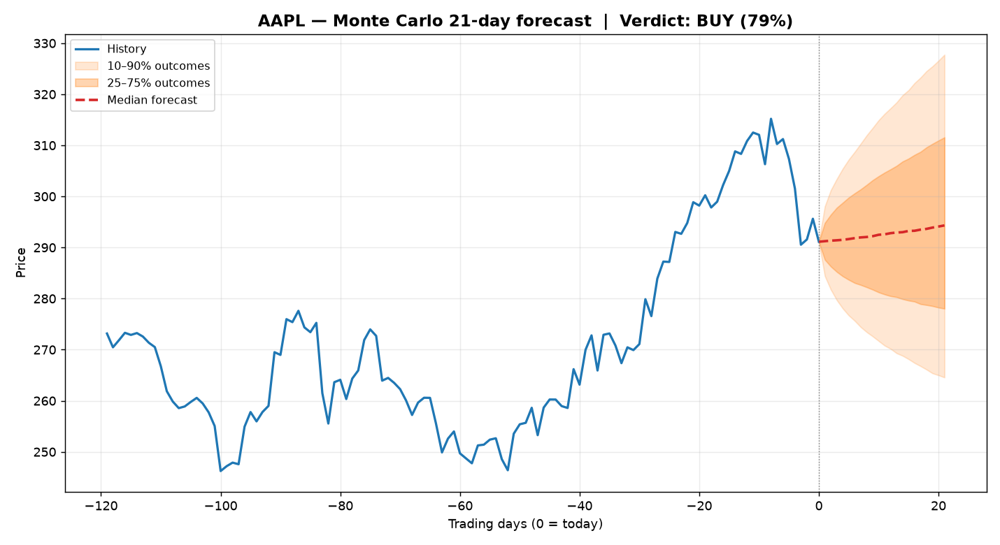

# 🏦 AI Investment Research Desk

> A **multi-agent AI system** that researches a stock the way a real hedge-fund desk does — specialist agents debate, a risk manager can **veto**, and a portfolio manager makes the final call — backed by a **Monte Carlo physics engine** and validated by a **historical backtest**.

Runs **100% free and offline**, or flip one switch (`--ai`) to power the agents with real **Claude** models.



> *Sample output — the Monte Carlo "cone of futures" for AAPL: blue is real price history, the orange fan is 20,000 simulated outcomes, and the dashed red line is the median forecast.*

```bash
python main.py AAPL          # free, offline, no account needed
python main.py NVDA --ai     # AI mode (Claude) — costs a few cents/run
```

---

## ✨ Why this project stands out

This isn't a "wrap one API call in a chatbot" project. It demonstrates the three things hiring managers in AI/ML actually look for in 2026:

| Capability | Where it shows up here |
|---|---|
| **Agentic AI / multi-agent orchestration** | 5 cooperating-and-arguing agents with distinct roles, a debate loop, and a veto mechanism |
| **Quantitative / scientific rigor** | A Monte Carlo engine grounded in real stochastic-process physics, plus a no-look-ahead backtest |
| **Production engineering judgment** | Graceful offline↔AI fallback, hard-coded safety guardrails the LLM *cannot* override, clean modular design, tiered model usage to control cost |

---

## 🧠 How it works

```
            ┌──────────────────────────────────────────────────────┐
            │                  ORCHESTRATOR                          │
            └──────────────────────────────────────────────────────┘
   market data ─▶ indicators ─▶ 🌀 Monte Carlo ─▶ analysts ─▶ debate
        │                                            │
        ▼                                            ▼
  Yahoo Finance                          ┌───────────────────────┐
  (or synthetic                          │  Fundamental Analyst  │
   fallback)                             │  Technical Analyst    │  each can be
                                         │  Sentiment Analyst    │  rule-based OR
                                         └───────────┬───────────┘  Claude-powered
                                                     ▼
                                          🛡️  Risk Manager  (hard veto)
                                                     ▼
                                          💼 Portfolio Manager (final call)
                                                     ▼
                                   📊 Backtest  +  📝 report  +  📈 fan chart
```

### 1. The agents
- **Fundamental Analyst** — valuation (P/E), growth, profitability.
- **Technical Analyst** — trend, RSI, momentum.
- **Sentiment Analyst** — news-headline tone (and price action as a proxy).
- **Risk Manager** — computes volatility & Value-at-Risk and can **VETO** a BUY. This veto is a *deterministic guardrail*: in AI mode the language model can write commentary but **cannot** override the numbers. (Separating creative reasoning from non-negotiable safety rules is exactly how real production AI is built.)
- **Portfolio Manager** — weighs every opinion + the Monte Carlo odds, enforces the veto, and outputs a signal, confidence, **position size**, and a written thesis.

### 2. The physics engine 🌀
A stock price is modeled as a particle in **Brownian motion** — the same random-walk physics Einstein described in 1905 — via **Geometric Brownian Motion**:

```
dS = μ·S·dt + σ·S·dW
```

We simulate **20,000 possible futures** (Monte Carlo) and read the odds straight off the distribution: probability of profit, expected return, and **Value-at-Risk**.

> 🔬 *Fun fact for interviews:* the Black–Scholes equation that comes out of this model **is mathematically the heat/diffusion equation** from physics. Finance and thermodynamics share the same math.

### 3. The backtest 📊
Talk is cheap, so the desk **grades its own homework**: it replays its signal across history using only data available at each point (**no look-ahead bias**) and reports the BUY-signal hit-rate and strategy-vs-buy-and-hold performance.

---

## 🔀 The flip switch: Offline vs AI mode

| | 🆓 Offline (default) | 🤖 AI mode (`--ai`) |
|---|---|---|
| Cost | **Free, forever** | ~cents per run (your own key) |
| Account | None | Anthropic API key |
| Agent brains | Transparent deterministic rules | Real Claude reasoning + debate |
| Everything else | ✅ identical | ✅ identical |

AI mode uses a **cheap fast model** (`claude-haiku-4-5`) for the many analyst calls and the **strongest model** (`claude-opus-4-8`) only for the single final decision — a deliberate cost-control pattern.

---

## 🚀 Quickstart

```bash
# 1. Install (only ~150 MB — numpy/pandas/charts; no heavy ML frameworks)
pip install -r requirements.txt

# 2. Run it (free, offline)
python main.py AAPL

# 3. (Optional) turn on AI mode
cp .env.example .env          # then paste your Anthropic key into .env
python main.py AAPL --ai
```

Outputs land in [outputs/](outputs/): a Markdown report and a Monte Carlo forecast chart.

### 🌐 Web app (interactive dashboard)

```bash
streamlit run streamlit_app.py        # then open http://localhost:8501
```
An interactive UI with sliders, the AI-mode toggle, and a zoomable Plotly forecast chart — built on the exact same engine as the CLI.

### 📚 Want to understand every concept?

See **[STUDY_GUIDE.md](STUDY_GUIDE.md)** — a tutor-style breakdown of every finance and technical idea in this project (Monte Carlo, VaR/CVaR, multi-agent design, the safety veto…) plus an interview Q&A bank.

### Useful flags
```bash
python main.py TSLA --horizon 42     # change the forecast horizon (trading days)
python main.py MSFT --paths 50000    # more Monte Carlo paths = smoother odds
python main.py NVDA --no-chart       # skip the PNG
```

---

## 🗂️ Project structure

```
app2/
├── main.py                  # CLI entry point
├── ai_desk/
│   ├── config.py            # all tunable settings + model tiers
│   ├── data.py              # market data (real + synthetic fallback) & indicators
│   ├── physics.py           # 🌀 Monte Carlo GBM engine
│   ├── llm.py               # the offline↔AI flip switch
│   ├── agents.py            # the 5 agents (rule-based + Claude brains)
│   ├── orchestrator.py      # runs the full pipeline / debate loop
│   ├── backtest.py          # walk-forward calibration
│   └── report.py            # terminal dashboard + Markdown + chart
├── outputs/                 # generated reports & charts
└── requirements.txt
```

---

## 🎯 Skills this demonstrates (for your CV / LinkedIn)

- **Multi-agent AI systems** & orchestration (the #1 trending AI skill)
- **LLM application engineering** with the Anthropic / Claude API
- **AI safety thinking** — guardrails the model can't bypass
- **Quantitative finance** — Monte Carlo, VaR, backtesting without look-ahead
- **Applied physics / stochastic processes** — Brownian motion, GBM
- **Clean, production-minded Python** — modular, typed, documented, graceful fallbacks

### Suggested LinkedIn one-liner
> *Built an autonomous **multi-agent AI hedge-fund analyst**: specialist agents debate a stock, a risk manager vetoes dangerous trades, and a **Monte Carlo physics engine** (Geometric Brownian Motion) forecasts the odds — then it **backtests its own calls** against real market history. Runs free offline or powered by Claude. 🧵*

---

## ⚠️ Disclaimer
This is an **educational portfolio project**, not financial advice. Do not trade real money based on its output.
